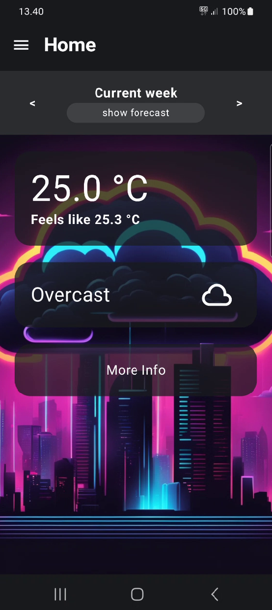
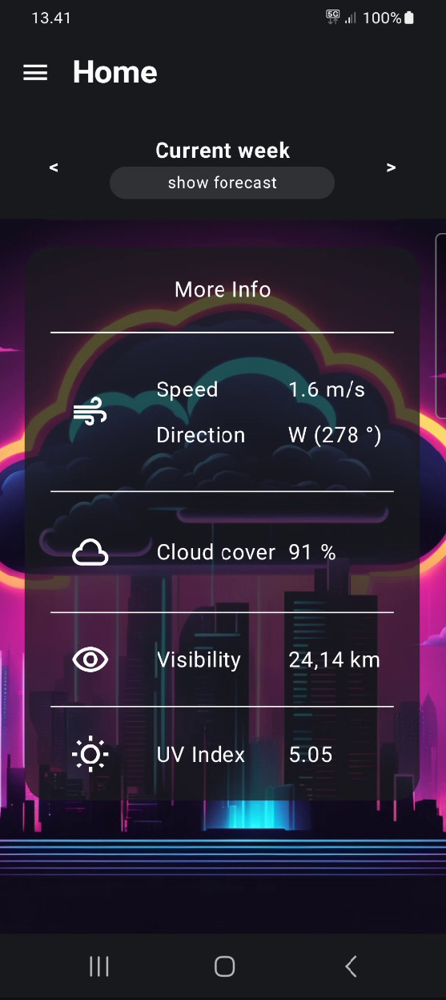
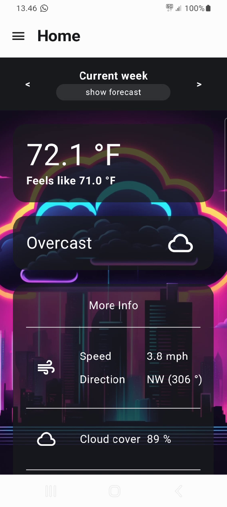
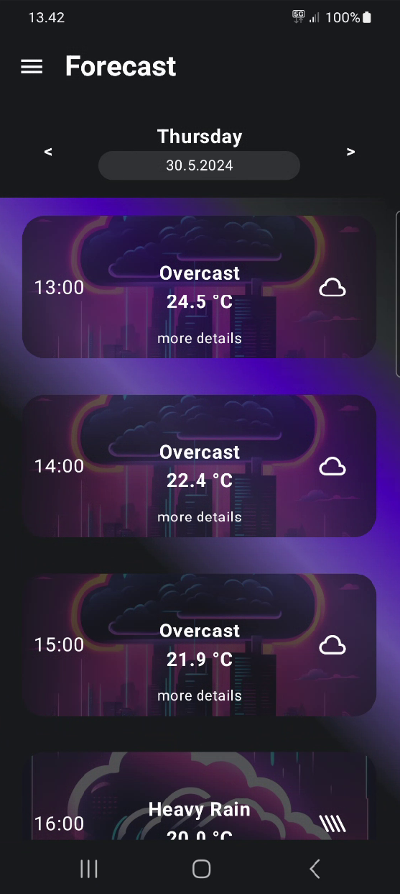
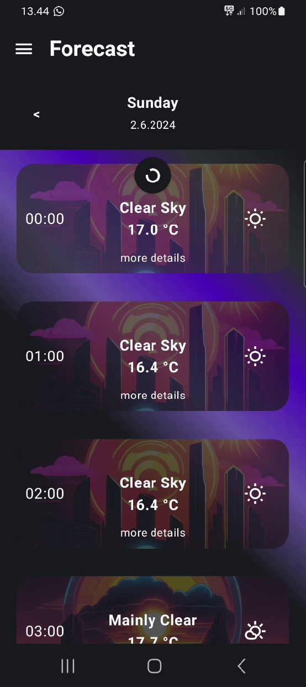
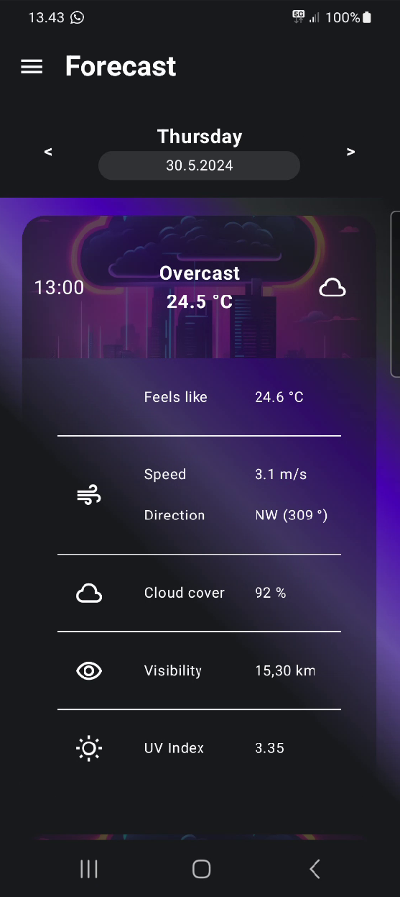
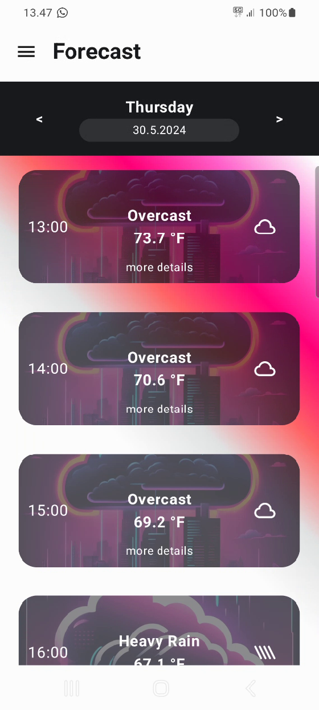
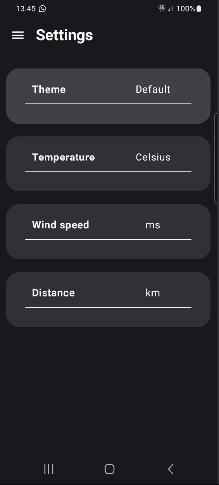
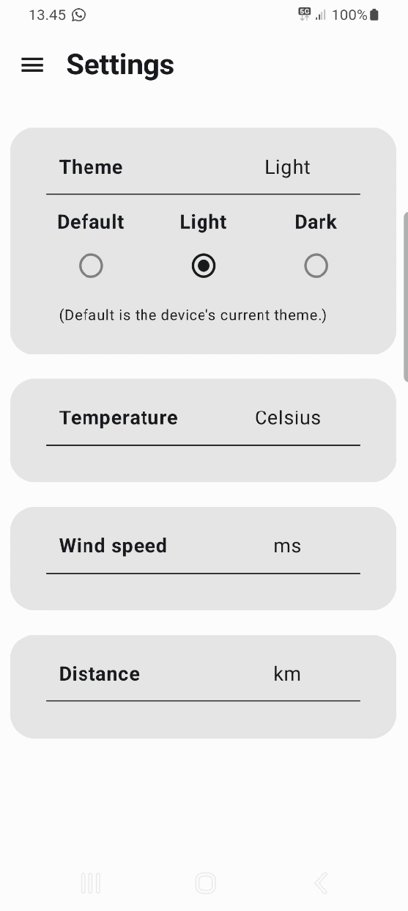

# Forecast Application

This application uses the current location of the user to fetch weather information from https://open-meteo.com and display it to the user in simple terms.

## Screen Cast
link to screen cast: 

## Home Screen
Home screen displays the current weather data and allows the user to refresh it by pulling down at the top of the list.

More info expands showing more weather information on click.

  

## Forecast Screen
Forecast screen displays the weather data for the selected week in scrollable lists by hour for each day and can also be refreshed by pulling down at the top of the list.

Each hour can also be expanded showing more weather information by simply clicking on it.

    

## Settings Screen
Settings screen allows the user to switch between themes and also switch the units of the provided weather information as shown in the pictures above.

 
